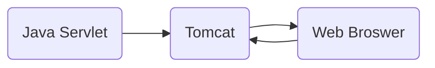


# Template of Assignment 1

## What is Included in the Template

- A Working Web Application which is a "simple todo list" (😎 Don't worry, it's working)
- Very simple user login and signup logic
- Basic CRUD operations (Create, Read, Update, and Delete)

## Intro to the architecture

Web Application



Backend
- Java 21
- javax.servlet-api 4.0.1
- Tomcat 9
- Maven

Frontend
- HTML, CSS, JS
- Bootstrap 3.0.0 for CSS styling

## Step-by-step Environment Setup Guide

The following guide is base on **CentOS 10 Stream** machine. (Kernel Version x86_64 Linux 6.12.0-39.el10.x86_64)

### Install Java 21 and Maven

The following command will install Maven and its dependencies (including Java 21) on your CentOS 10 Stream machine.

```bash
$ sudo yum install maven
```

Warning Again : If you are on a different linux distribution other than **CentOS**, you may have to use a different approach for every step.

By the way, to check the version of your default Java, run this command:

```bash
$ java --version
```

You should see something like this:

```text
openjdk 21.0.5 2024-10-15 LTS
OpenJDK Runtime Environment (Red_Hat-21.0.5.0.11-1) (build 21.0.5+11-LTS)
OpenJDK 64-Bit Server VM (Red_Hat-21.0.5.0.11-1) (build 21.0.5+11-LTS, mixed mode, sharing)
```

If you have different Java version installed locally, you may want to use **alternative** command.

```bash
sudo update-alternatives --config java
```

Here is an example of the output:
```
There are 2 programs which provide 'java'.

Selection Command

-----------------------------------------------

*+ 1           /usr/lib/jvm/java-21-openjdk/bin/java

   2           /usr/lib/jvm/java-1.8.0-openjdk-1.8.0.151-5.b12.el7_4.x86_64/jre/bin/java

Enter to keep the current selection[+], or type selection number:

```

Verify the installation of Maven

```bash
$ mvn -version
```

Output:
```
Apache Maven 3.9.9 (Red Hat 3.9.9-1)
Maven home: /usr/share/maven
Java version: 21.0.5, vendor: Red Hat, Inc., runtime: /usr/lib/jvm/java-21-openjdk
Default locale: en_US, platform encoding: UTF-8
OS name: "linux", version: "6.12.0-39.el10.x86_64", arch: "amd64", family: "unix"
```

### Install and run Tomcat 9

```bash
$ sudo yum install tomcat
```

To verify the installation, you can check the version of the installed Tomcat:

```bash
$ tomcat version
```

Output:

```text
NOTE: Picked up JDK_JAVA_OPTIONS:  --add-opens=java.base/java.lang=ALL-UNNAMED --add-opens=java.base/java.io=ALL-UNNAMED --add-opens=java.base/java.util=ALL-UNNAMED --add-opens=java.base/java.util.concurrent=ALL-UNNAMED --add-opens=java.rmi/sun.rmi.transport=ALL-UNNAMED
Server version: Apache Tomcat/9.0.87
Server built:   Oct 29 2024 00:00:00 UTC
Server number:  9.0.87.0
OS Name:        Linux
OS Version:     6.12.0-39.el10.x86_64
Architecture:   amd64
JVM Version:    21.0.5+11-LTS
JVM Vendor:     Red Hat, Inc.
```

### Install and Configure MySQL

```bash
$ sudo yum install mysql-server
```

**Starting MySQL**

Once the installation is completed, start the MySQL service and enable it to automatically start on boot with:

```bash
$ sudo systemctl enable mysqld
$ sudo systemctl start mysqld
```

We can check the MySQL service status by typing:
```bash
sudo systemctl status mysqld
```

Output

```text
● mysqld.service - MySQL 8.4 database server
     Loaded: loaded (/usr/lib/systemd/system/mysqld.service; enabled; preset: disabled)
     Active: active (running) since Mon 2025-02-03 23:51:37 UTC; 21h ago
 Invocation: 0dd1970294bd406d8ea346f54f3d7440
   Main PID: 7888 (mysqld)
     Status: "Server is operational"
      Tasks: 36 (limit: 10816)
     Memory: 435.5M (peak: 454.4M, swap: 52.2M, swap peak: 53.7M)
        CPU: 6min 50.483s
     CGroup: /system.slice/mysqld.service
             └─7888 /usr/libexec/mysqld --basedir=/usr
```

**Securing MySQL**

Run the `mysql_secure_installation` command to improve the security of our MySQL installation:

```bash
$ sudo mysql_secure_installation
```

The script will also ask you to remove the anonymous user, restrict root user access to the local machine and remove the test database. You should answer “Y” (yes) to all questions.

**Connecting to MySQL from the command line**

To log in to the MySQL server as the root user type:

```bash
mysql -u root -p
```

**Create a Database**

Once you are connected to the MySQL shell, you can create a new database by typing the following command:

```sql
CREATE DATABASE list;
```

**Create a Table**

You don't have to create a table yourself. The Java servlet application will create it for you on the fly when it is running.

**Create a MySQL User**
```sql
CREATE USER 'boss'@'localhost' IDENTIFIED BY  'AAAAAbbbbb888;8';
GRANT ALL PRIVILEGES ON list.*  TO  'boss'@'localhost';
ALTER USER 'boss'@'localhost' IDENTIFIED WITH mysql_native_password BY  'AAAAAbbbbb888;8';
FLUSH PRIVILEGES;
```

Make sure you copy-paste the above commands. They are very important.


## Compile the Application

`cd` into the project template folder

```bash
$ mvn clean package
```

This command will generate a `war` (Web Application Archive) file in the `target` folder.

## Deploy and Run the Application

Copy the `war` file to the tomcat webapps folder

```bash
$ sudo cp target/my-webapp.war /var/lib/tomcat/webapps/
```

Start the tomcat service

```bash
$ tomcat start
```

Go to you web browser, navigate to `ip-of-your-server:8080\my-webapp`

If you host the service on local machine, go to `localhost:8080\my-webapp`

Note: If you use a remote server, make sure you update the firewall settings to allow traffic on port 8080.

You can register an account and login to see if everything is right.


  

Authors: Enkai Ji

Updated by Haoyang Zhang for CentOS 10 Stream, Java 21 and Tomcat 9